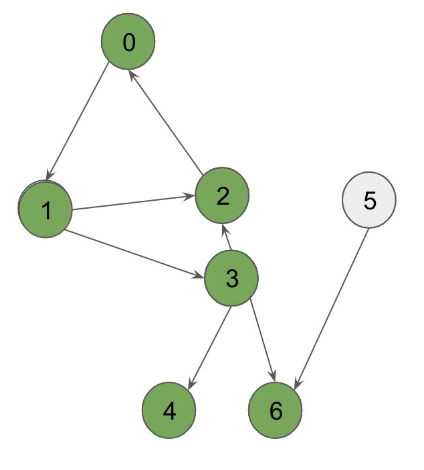

# DFS_ALL
all nodes are visited and returns the visited nodes in DFS order in a vector

Input: 



output: [0, 1, 3, 2, 4, 6, 5]

Run with
```
bazel run src/main:main
```

Test with
```
bazel test tests:tests
```
